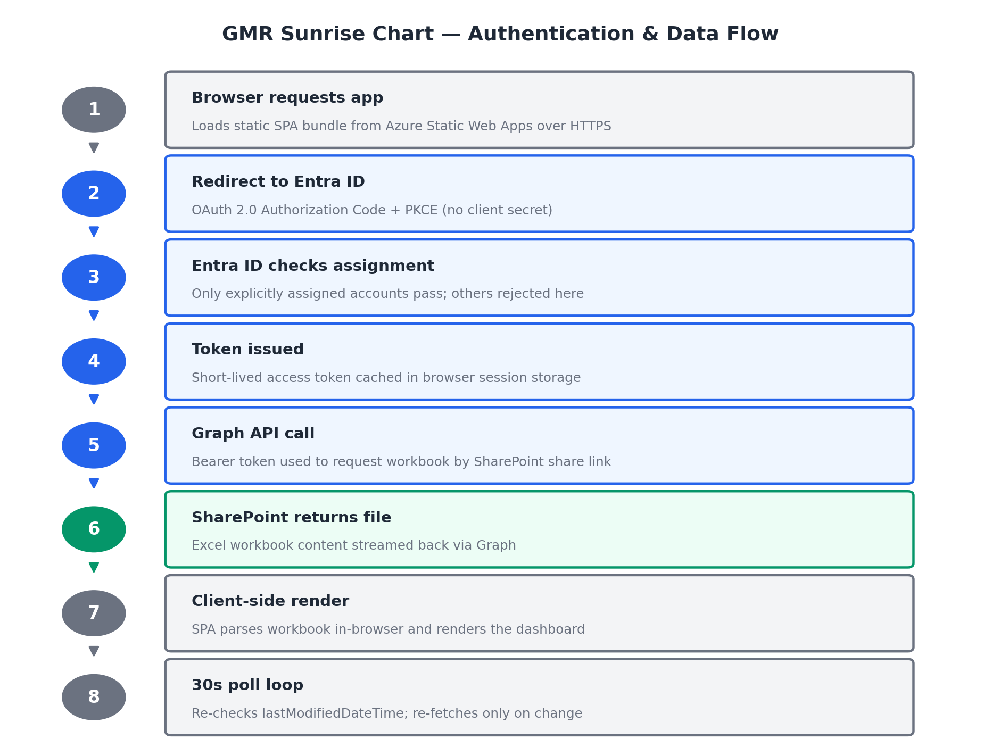

# GMR Sunrise Chart — Tech Stack, Architecture & Security Document

**Prepared for:** GMR SSC — IT Department
**Prepared by:** HARTS (Global Harts)
**Document date:** July 2026
**Application:** GMR Sunrise Chart

---

## 1. Technology Stack

The application is a **single-page web application (SPA)** with **no backend server and no database of its own**. There is no application server to patch and no database to secure — the entire application is a set of static files served over HTTPS, and all real data lives in Microsoft 365 (SharePoint), protected by Microsoft's own security controls.

| Layer | Technology | Notes |
|---|---|---|
| UI framework | React 18 | Industry-standard, widely supported |
| Build tool | Vite | Compiles the app into static HTML/CSS/JS files |
| Styling | Tailwind CSS | Utility-first styling framework |
| Spreadsheet parsing | SheetJS (xlsx) | Reads Excel workbooks client-side |
| Authentication | Microsoft MSAL (React/Browser) | Official Microsoft library for Entra ID sign-in |
| Data source | Microsoft Graph API → SharePoint | No custom API, no custom database |
| Hosting | Azure Static Web Apps | Static file hosting with built-in HTTPS and security-headers config |

**No servers, no containers, no infrastructure to manage day-to-day.** The only ongoing dependency is Microsoft 365 itself (Entra ID for identity, SharePoint/Graph for data).

---

## 2. Application Flow

1. Browser loads the static SPA bundle from Azure Static Web Apps over HTTPS.
2. SPA redirects to Microsoft Entra ID using OAuth 2.0 Authorization Code + PKCE (no client secret required for this flow).
3. Entra ID authenticates the user and enforces **"assignment required"** — only explicitly assigned accounts receive a token; everyone else is rejected at this step, before the SPA loads any data.
4. Entra ID returns a short-lived access token, cached in browser **session storage** (not localStorage, not cookies).
5. SPA calls Microsoft Graph API with the token as a Bearer header, requesting the two Excel workbooks from SharePoint by share link.
6. Graph API returns workbook content from SharePoint; SPA parses it client-side and renders the dashboard.
7. Token renewal is silent (`acquireTokenSilent`); re-authentication via redirect only triggers on genuine session expiry.
8. A 30-second polling check (`lastModifiedDateTime`) re-fetches only when the source file actually changed.

Access control has one real enforcement boundary: **Entra ID sign-in + assignment** (step 3). A secondary email allow-list gates one cosmetic UI toggle (marking a task done on-screen) — it is not a backend permission system, since nothing is written back to SharePoint.

---

## 3. Security Implementation

| Area | Measure | Detail |
|---|---|---|
| Transport security | HTTPS + HSTS | Azure Static Web Apps enforces TLS; HSTS forces browsers to always use HTTPS. |
| Security headers | CSP, X-Frame-Options, X-Content-Type-Options, Referrer-Policy, Permissions-Policy, COOP | Configured in `staticwebapp.config.json`. CSP restricts outbound calls to only Microsoft Graph, Microsoft login, SharePoint, and Google Fonts. |
| Authentication | Microsoft Entra ID via MSAL, OAuth2 + PKCE | No passwords handled or stored by the app; no client secret required. |
| Access control | Entra ID "assignment required" | Enforced by Microsoft, outside the app's own code — centrally managed by GMR IT. |
| Secrets management | No secrets in the codebase | Only non-sensitive build-time identifiers (client ID, tenant ID, SharePoint links, editor email list) are baked into the bundle — none usable to bypass Microsoft's login. |
| Attack surface | No custom backend, no database | Nothing to breach or misconfigure server-side; data protection relies on Microsoft's own Entra ID/SharePoint security. |
| Input handling | Framework-level output escaping | React escapes all rendered data by default — standard XSS defense. |
| Session handling | Session-scoped token storage | Tokens cleared when the browser session ends. |
| Write protection | Read-only against source data | No code path writes to SharePoint; on-screen task toggles are local-only. |

---

## 4. Configuration Requirements — If Hosted via Object Storage + CDN

This app can be hosted two ways: (a) an all-in-one static web hosting service (e.g., Azure Static Web Apps, Netlify, Vercel) where HTTPS, CDN, SPA routing, and headers are pre-wired for you, or (b) assembled manually from Object Storage + CDN (e.g., AWS S3 + CloudFront, Azure Blob Storage + Azure CDN/Front Door, GCP Cloud Storage + Cloud CDN). Option (a) needs no configuration beyond uploading the build. Option (b) requires the configuration below to be replicated manually, so it is documented here for whichever vendor/approach IT selects.

### 4.1 Files to Deploy
- Upload the entire contents of the `dist/` folder produced by `npm run build` (~1.3MB total: `index.html`, `/assets/*.js`, `/assets/*.css`, plus static files from `public/`).
- No server-side code, no database, nothing else to deploy.

### 4.2 Object Storage / Bucket Settings
- Enable "static website hosting" mode on the storage container/bucket.
- Index document: `index.html`
- Error document: `index.html` (see SPA fallback rule below — this is not a generic error page, it's required for client-side routing to work)
- Public read-only access to these static assets. No write access is needed by anything at runtime — content is uploaded only at deploy time.

### 4.3 CDN Configuration
- **Origin:** the storage bucket/container above.
- **HTTPS:** mandatory. Microsoft Entra ID login will refuse to redirect to a non-HTTPS URL (except `localhost`). A TLS certificate must be issued for the domain (most CDNs provide free managed certificates for this).
- **Compression:** enable gzip/Brotli at the CDN. The JS bundle is ~913KB uncompressed but ~284KB gzipped — compression must be on for reasonable load times.
- **SPA rewrite/fallback rule (critical):** any request for a path that isn't a real file on disk (e.g., a deep link, or a browser refresh on a client-side route, or the return from the Microsoft login redirect) must be served as `/index.html`. Without this, users will hit blank/404 pages on refresh or after signing in.

### 4.4 Required Response Headers
Configure these at the CDN layer (rules engine / edge function) — object storage alone typically cannot set custom response headers per route:

| Header | Value |
|---|---|
| Content-Security-Policy | `default-src 'self'; base-uri 'self'; object-src 'none'; frame-ancestors 'none'; script-src 'self'; style-src 'self' 'unsafe-inline' https://fonts.googleapis.com; font-src 'self' https://fonts.gstatic.com; img-src 'self' data: blob: https://*.sharepoint.com https://*.svc.ms; connect-src 'self' https://graph.microsoft.com https://login.microsoftonline.com https://*.sharepoint.com https://*.svc.ms; frame-src 'self' https://login.microsoftonline.com; form-action 'self' https://login.microsoftonline.com; worker-src 'self' blob:; manifest-src 'self'; upgrade-insecure-requests` |
| Strict-Transport-Security | `max-age=31536000; includeSubDomains` |
| X-Content-Type-Options | `nosniff` |
| X-Frame-Options | `DENY` |
| Referrer-Policy | `strict-origin-when-cross-origin` |
| X-XSS-Protection | `0` |
| Permissions-Policy | `accelerometer=(), autoplay=(), camera=(), display-capture=(), encrypted-media=(), fullscreen=(self), geolocation=(), gyroscope=(), magnetometer=(), microphone=(), midi=(), payment=(), picture-in-picture=(), usb=()` |
| Cross-Origin-Opener-Policy | `same-origin-allow-popups` |

These headers are already defined once, centrally, in this app's `staticwebapp.config.json`. On an all-in-one static hosting service, no extra work is needed — the platform reads this file directly. Via Object Storage + CDN, IT must replicate this same header set manually in the CDN's rules configuration.

### 4.5 Cache Policy

| Path | Cache-Control | Why |
|---|---|---|
| `/index.html` | `no-cache, no-store, must-revalidate` | Always fetch fresh — this file references the current content-hashed JS/CSS filenames |
| `/assets/*` (JS/CSS, content-hashed filenames) | `public, max-age=31536000, immutable` | Safe to cache for a year — the filename itself changes whenever the content changes |

### 4.6 DNS / Custom Domain
- Finalize the domain (custom domain or the CDN's default domain) before go-live.
- The exact HTTPS URL must then be registered as a redirect URI in **Microsoft Entra ID → App registration → Authentication → Single-page application** — required for Microsoft login to work. This step applies no matter which hosting approach is chosen.

### 4.7 Explicitly Not Needed
- No server-side runtime, no compute instance, no container, no database, no backend API.
- No inbound network rules beyond standard HTTPS (443).
- No write access at runtime — deployment is upload-only, from the build machine to storage, at release time.

---

## 5. CI/CD Deployment via GitHub (if applicable)

If deployment is triggered automatically from GitHub (push/merge to a branch) rather than a manual local build-and-upload, the pipeline needs the following regardless of which hosting vendor is chosen. There is currently no GitHub Actions workflow configured in this repository — this section is what needs to be set up.

### 5.1 What the Pipeline Does, Every Deploy
1. Checks out the repository code.
2. Runs `npm install` and `npm run build` (produces `dist/`) — this step needs the build-time variables below.
3. Publishes `dist/` to the hosting target — the exact step differs by vendor (see 5.4).

### 5.2 Repository Secrets Required
Two categories of values must be stored as **GitHub encrypted repository secrets** (Settings → Secrets and variables → Actions) — never committed to the repo itself:

| Category | Values | Purpose |
|---|---|---|
| Build-time app config | `VITE_CLIENT_ID`, `VITE_TENANT_ID`, `VITE_EXCEL_FILE_URL`, `VITE_FMEA_FILE_URL`, `VITE_ADMIN_EMAILS` | Same values currently in the local `.env` file — Vite bakes these into the build output, so the CI build step needs them available as env vars during `npm run build` |
| Deployment credential | Vendor-specific (e.g., a Static Web Apps deployment token, or an IAM/service-account key scoped to a storage bucket + CDN) | Lets the GitHub Action push the built files to the hosting target |

None of the `VITE_*` values are secrets that grant access on their own (per Section 3 — no client secret is used, and Entra ID's "assignment required" is the real access control), but they should still be stored as GitHub secrets rather than hardcoded, as standard practice.

### 5.3 Trigger
Typically: run on push/merge to the production branch (e.g., `main`). Optionally, a separate preview deployment on pull requests, if the vendor's tooling supports it (common with all-in-one static hosting services).

### 5.4 The Deploy Step Differs by Hosting Choice
- **All-in-one static hosting service** (Azure Static Web Apps, Netlify, Vercel): connecting the GitHub repo through the vendor's setup wizard typically auto-generates the whole workflow file, including the deploy step and credential — least setup effort.
- **Object Storage + CDN**: the workflow's final step must be authored manually — sync `dist/` to the storage bucket/container, then trigger a CDN cache invalidation/purge so users don't keep receiving stale cached files after a deploy.

### 5.5 Access Scope
Whatever deployment credential is generated for GitHub Actions should be scoped as narrowly as possible — write access to the one storage bucket/container (and CDN purge permission) used by this app, nothing broader. This is a configuration choice IT should apply regardless of vendor.
